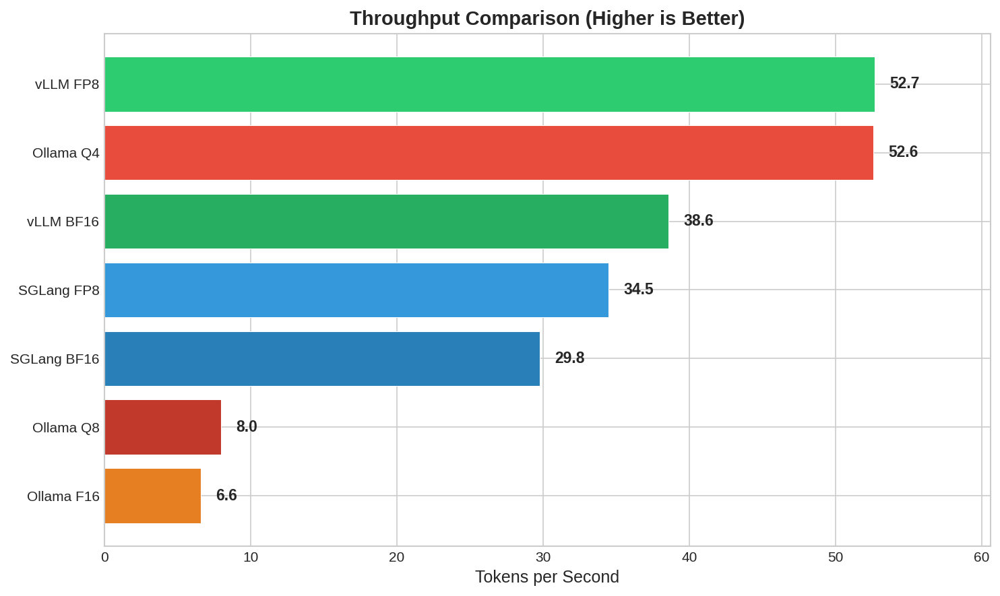
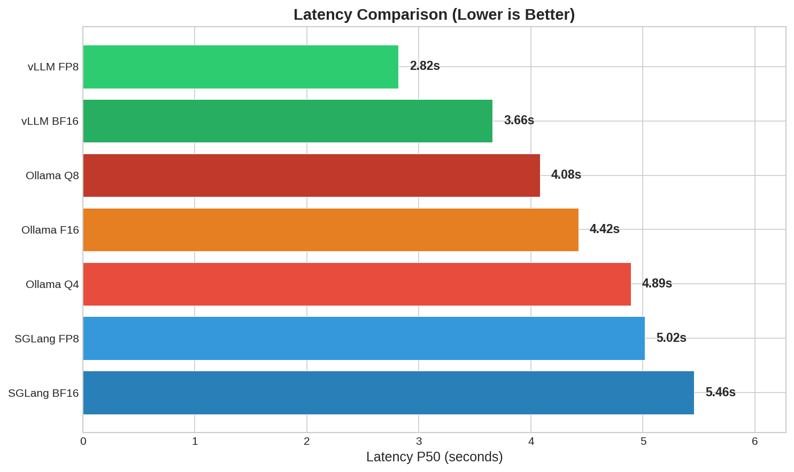
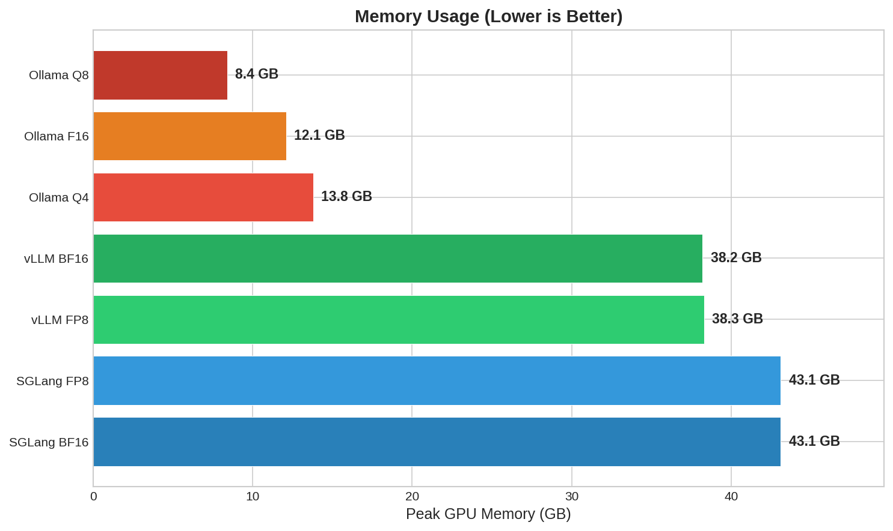
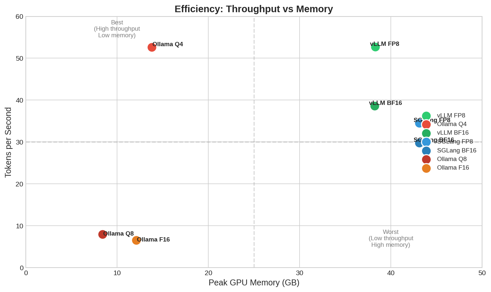

# VLM Benchmark Suite

Benchmarking framework for Vision-Language Models (VLMs) with multiple inference backends.

## Table of Contents

- [Overview](#overview)
- [Quick Start](#quick-start)
- [Results](#results)
- [Methodology](#methodology)
- [Backends](#backends)
- [Configuration](#configuration)
- [Troubleshooting](#troubleshooting)

## Overview

Benchmark video understanding capabilities across inference backends and quantization levels:

| Backend | Features | Quantization Support |
|---------|----------|---------------------|
| [vLLM](https://docs.vllm.ai/) | PagedAttention, prefix caching, chunked prefill | BF16, FP8 |
| [SGLang](https://github.com/sgl-project/sglang) | FlashInfer attention, RadixAttention | BF16, FP8 |
| [Ollama](https://ollama.ai/) | GGUF quantization, CPU/GPU hybrid | F16, Q8_0, Q4_K_M |

**Model**: [Qwen3-VL-4B-Instruct](https://huggingface.co/Qwen/Qwen3-VL-4B-Instruct) (4 billion parameters)

**Key Results** (RTX A6000):
- **Fastest**: vLLM FP8 at 52.7 tokens/s (2.8s latency)
- **Most efficient**: Ollama Q4 at 52.6 tokens/s using only 13.8 GB VRAM
- **Lowest memory**: Ollama Q8 at 8.4 GB VRAM

## Quick Start

### Requirements

- NVIDIA GPU with CUDA ([tested on RTX A6000](https://www.nvidia.com/en-us/design-visualization/rtx-a6000/))
- [Docker](https://docs.docker.com/get-docker/) with [NVIDIA Container Toolkit](https://docs.nvidia.com/datacenter/cloud-native/container-toolkit/)
- [Python 3.10+](https://www.python.org/downloads/)

### Install

```bash
pip install -r requirements.txt
```

### Run All Benchmarks

```bash
./scripts/run_all_benchmarks.sh
```

### Run Single Backend

```bash
# vLLM
docker build -t docker-vllm-awq -f docker/vllm-awq/Dockerfile docker/vllm-awq/
docker run -d --gpus all --name vlm-bench-vllm-awq -p 28001:28001 \
    -v ~/.cache/huggingface:/root/.cache/huggingface docker-vllm-awq

python src/benchmark.py --config configs/benchmark_vllm.yaml

docker stop vlm-bench-vllm-awq && docker rm vlm-bench-vllm-awq
```

## Results

Output organized by precision:
- `results/bf16/` - BFloat16 comparisons
- `results/fp8/` - FP8 comparisons
- `results/8bit/` - 8-bit comparisons
- `results/4bit/` - 4-bit (Ollama only)

### Metrics

| Metric | Description |
|--------|-------------|
| `latency_mean_ms` | Average inference latency |
| `latency_p50_ms` | Median latency (50th percentile) |
| `latency_p90_ms` | 90th percentile latency |
| `tokens_per_second` | Generation throughput |
| `peak_memory_mb` | Peak GPU VRAM usage |

### Benchmark Results (RTX A6000, 48GB VRAM)

Test configuration: 5 videos, 4 frames each, 256 max tokens, 1 warmup + 5 benchmark runs.

#### Group 1: BFloat16 (Full Precision)

| Backend | Latency P50 | Latency P90 | Tokens/s | Peak Memory |
|---------|-------------|-------------|----------|-------------|
| **vLLM** | 3,658 ms | 3,664 ms | 38.6 | 38.2 GB |
| SGLang | 5,458 ms | 5,687 ms | 29.8 | 43.1 GB |
| Ollama (F16 GGUF) | 4,423 ms | 4,450 ms | 6.6 | 12.1 GB |

#### Group 2: FP8 Quantization (W8A16)

| Backend | Latency P50 | Latency P90 | Tokens/s | Peak Memory |
|---------|-------------|-------------|----------|-------------|
| **vLLM FP8** | 2,819 ms | 2,870 ms | 52.7 | 38.3 GB |
| SGLang FP8 | 5,017 ms | 5,277 ms | 34.5 | 43.1 GB |

#### Group 3: 8-bit Quantization

| Backend | Latency P50 | Latency P90 | Tokens/s | Peak Memory |
|---------|-------------|-------------|----------|-------------|
| Ollama (Q8_0 GGUF) | 4,081 ms | 6,576 ms | 8.0 | 8.4 GB |
| vLLM AWQ | ❌ Skipped | - | - | - |
| SGLang AWQ | ❌ Skipped | - | - | - |

> **Note**: AWQ benchmarks skipped due to model format incompatibility. The [cyankiwi/Qwen3-VL-4B-Instruct-AWQ-8bit](https://huggingface.co/cyankiwi/Qwen3-VL-4B-Instruct-AWQ-8bit) model uses "compressed-tensors" format instead of standard AWQ.

#### Group 4: 4-bit Quantization

| Backend | Latency P50 | Latency P90 | Tokens/s | Peak Memory |
|---------|-------------|-------------|----------|-------------|
| **Ollama (Q4_K_M GGUF)** | 4,891 ms | 4,900 ms | 52.6 | 13.8 GB |

### Performance Summary

| Rank | Backend | Precision | Throughput | Latency P50 | Memory |
|------|---------|-----------|------------|-------------|--------|
| 1 | **vLLM FP8** | FP8 | 52.7 tok/s | 2,819 ms | 38.3 GB |
| 2 | **Ollama Q4** | 4-bit | 52.6 tok/s | 4,891 ms | 13.8 GB |
| 3 | vLLM BF16 | BF16 | 38.6 tok/s | 3,658 ms | 38.2 GB |
| 4 | SGLang FP8 | FP8 | 34.5 tok/s | 5,017 ms | 43.1 GB |
| 5 | SGLang BF16 | BF16 | 29.8 tok/s | 5,458 ms | 43.1 GB |
| 6 | Ollama Q8 | 8-bit | 8.0 tok/s | 4,081 ms | 8.4 GB |
| 7 | Ollama F16 | BF16 | 6.6 tok/s | 4,423 ms | 12.1 GB |

### Visualizations

#### Throughput Comparison


#### Latency Comparison


#### Memory Usage


#### Efficiency: Throughput vs Memory


### Key Findings

#### vLLM FP8 is the fastest

- **52.7 tokens/second** with 2,819ms P50 latency
- 37% faster than vLLM BF16 (38.6 tok/s)
- 53% faster than SGLang FP8 (34.5 tok/s)
- FP8 W8A16 quantization on Ampere GPUs provides speed boost without accuracy loss
- [Prefix caching](https://docs.vllm.ai/en/latest/automatic_prefix_caching/apc.html) and [chunked prefill](https://docs.vllm.ai/en/latest/models/performance.html) contribute to performance

#### Ollama Q4 achieves best memory efficiency

- **52.6 tokens/second** with only **13.8 GB memory** (64% less than vLLM FP8)
- Matches vLLM FP8 throughput at fraction of memory cost
- [GGUF Q4_K_M](https://huggingface.co/docs/hub/gguf) quantization compresses 4B params effectively
- 73% latency tradeoff (4,891ms vs 2,819ms)

#### vLLM consistently outperforms SGLang

- BF16: vLLM 30% faster (38.6 vs 29.8 tok/s)
- FP8: vLLM 53% faster (52.7 vs 34.5 tok/s)
- SGLang uses more memory (43.1 GB vs 38.2-38.3 GB)

#### Ollama GGUF quantization varies widely

| GGUF Format | Throughput | Memory | Notes |
|-------------|------------|--------|-------|
| Q4_K_M | 52.6 tok/s | 13.8 GB | Best balance |
| Q8_0 | 8.0 tok/s | 8.4 GB | Unexpectedly slow |
| F16 | 6.6 tok/s | 12.1 GB | Full precision GGUF |

> Q4_K_M significantly outperforms Q8_0 and F16 in throughput. This suggests Ollama's GGUF runtime is optimized for 4-bit inference.

### Recommendations

| Use Case | Backend | Why |
|----------|---------|-----|
| **Production (speed)** | vLLM FP8 | Fastest throughput (52.7 tok/s), lowest latency (2.8s) |
| **Memory constrained** | Ollama Q4 | 13.8 GB vs 38 GB, matches vLLM throughput |
| **Consumer GPU (8-16 GB)** | Ollama Q4 | Fits in 16 GB VRAM with room for OS |
| **Minimum memory** | Ollama Q8 | 8.4 GB, fits on 10 GB GPUs |
| **Development** | vLLM BF16 | Good performance, no quantization artifacts |

### Cost-Performance Analysis

| Backend | Tokens/GB | Efficiency Rank |
|---------|-----------|-----------------|
| Ollama Q8 | 0.95 tok/s/GB | 1 (best) |
| Ollama Q4 | 3.81 tok/s/GB | 2 |
| vLLM FP8 | 1.38 tok/s/GB | 3 |
| vLLM BF16 | 1.01 tok/s/GB | 4 |
| SGLang FP8 | 0.80 tok/s/GB | 5 |
| SGLang BF16 | 0.69 tok/s/GB | 6 |
| Ollama F16 | 0.55 tok/s/GB | 7 |

Compare results: `python src/compare.py results/*.json`

## Methodology

### Benchmark Process

1. **Warmup** - 1 inference run to populate caches (excluded from results)
2. **Benchmark** - 5 runs per video, metrics averaged
3. **Metrics** - Latency (p50/p90/p99), throughput (tokens/s), GPU memory

### Test Configuration

| Parameter | Value | Rationale |
|-----------|-------|-----------|
| Videos | 5 | Quick iteration while statistically meaningful |
| Frames/video | 4 | Balance between context and speed |
| Warmup runs | 1 | Populate caches, excluded from results |
| Benchmark runs | 5 | Average across multiple runs |
| Temperature | 0.0 | Deterministic outputs for reproducibility |
| Max tokens | 256 | Sufficient for video descriptions |
| GPU memory fraction | 0.75 | Prevent OOM, leave headroom for system |

### Hardware

- **GPU**: NVIDIA RTX A6000 (48 GB VRAM)
- **CUDA**: 12.1
- **Driver**: 535.x

### Why These Backends?

| Backend | Why Included |
|---------|--------------|
| [vLLM](https://docs.vllm.ai/) | Industry standard, best throughput with [PagedAttention](https://arxiv.org/abs/2309.06180) |
| [SGLang](https://github.com/sgl-project/sglang) | Emerging alternative with [RadixAttention](https://arxiv.org/abs/2312.07104) |
| [Ollama](https://ollama.ai/) | Lightweight option using [GGUF quantization](https://github.com/ggerganov/ggml) |

## Backends

### By Precision (Fair Comparisons)

| Precision | vLLM | SGLang | Ollama | Config Dir |
|-----------|------|--------|--------|------------|
| **BFloat16** | [vllm-awq/](docker/vllm-awq/) :28001 | [sglang/](docker/sglang/) :28004 | F16 GGUF :28434 | [configs/bf16/](configs/bf16/) |
| **FP8** | [vllm-fp8/](docker/vllm-fp8/) :28002 | [sglang-fp8/](docker/sglang-fp8/) :28005 | ❌ | [configs/fp8/](configs/fp8/) |
| **8-bit** | ❌ AWQ incompatible* | ❌ AWQ incompatible* | Q8_0 GGUF | [configs/8bit/](configs/8bit/) |
| **4-bit** | ❌ | ❌ | Q4_K_M GGUF | [configs/4bit/](configs/4bit/) |

> *AWQ model [cyankiwi/Qwen3-VL-4B-Instruct-AWQ-8bit](https://huggingface.co/cyankiwi/Qwen3-VL-4B-Instruct-AWQ-8bit) uses "compressed-tensors" format, incompatible with vLLM/SGLang AWQ loaders.

### Models Used

| Precision | Model |
|-----------|-------|
| BFloat16 | [Qwen/Qwen3-VL-4B-Instruct](https://huggingface.co/Qwen/Qwen3-VL-4B-Instruct) |
| FP8 | [Qwen/Qwen3-VL-4B-Instruct-FP8](https://huggingface.co/Qwen/Qwen3-VL-4B-Instruct-FP8) |
| AWQ 8-bit | [cyankiwi/Qwen3-VL-4B-Instruct-AWQ-8bit](https://huggingface.co/cyankiwi/Qwen3-VL-4B-Instruct-AWQ-8bit) |
| GGUF | [Qwen/Qwen3-VL-4B-Instruct-GGUF](https://huggingface.co/Qwen/Qwen3-VL-4B-Instruct-GGUF) |

### Thinking Mode

Add `/think` prefix for reasoning mode. See configs:
- [benchmark_vllm_thinking.yaml](configs/benchmark_vllm_thinking.yaml)
- [benchmark_sglang_thinking.yaml](configs/benchmark_sglang_thinking.yaml)
- [benchmark_ollama_thinking.yaml](configs/benchmark_ollama_thinking.yaml)

## Configuration

Example: [configs/benchmark_vllm.yaml](configs/benchmark_vllm.yaml)

```yaml
backend:
  type: vllm
  base_url: http://localhost:28001
  model: Qwen/Qwen3-VL-4B-Instruct

benchmark:
  video_dir: video
  num_videos: 5
  frames_per_video: 4
```

See [configs/backends/](configs/backends/) for backend-specific options.

## Troubleshooting

| Issue | Solution |
|-------|----------|
| GPU OOM | Run [cleanup_gpu.sh](scripts/cleanup_gpu.sh) to stop containers and free VRAM |
| Timeout during startup | Increase `wait_ready` timeout in scripts (default: 300s) |
| Ollama BF16 timeout | Use 600s timeout - 8.9GB F16 GGUF model is slow to load |
| AWQ model error | Model uses "compressed-tensors" format, not AWQ - use FP8 instead |
| Container logs | `docker logs vlm-bench-<backend>` |
| GPU memory contention | Stop competing containers: `docker ps` and `docker stop <id>` |
| Benchmark hangs | Check if endpoint is ready: `curl http://localhost:<port>/v1/models` |

## License

MIT
